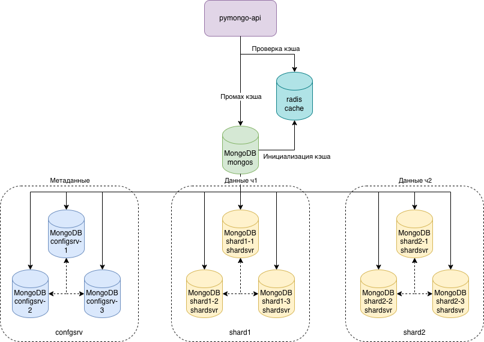
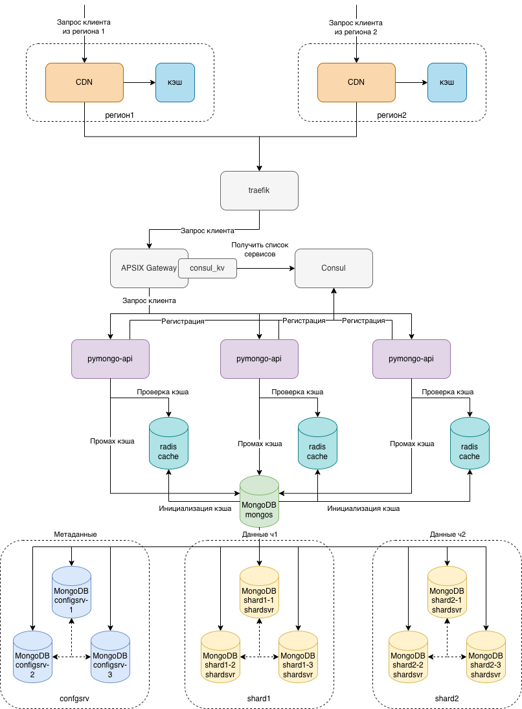
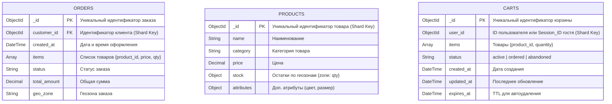

# СПЛИТ 4


# Результат заданий 1-6

## Схемы

В папке `task-1` указаны схемы в `.drawio` и `.png` по шагам.

Итоговый результат в папке `sharding-repl-cache`

Схема `docker-compose`


Схема с CDN и геораспределением
 


Файлы .drawio  
[Схема sprint-4-task-1-3.drawio](./task-1/sprint-4-task-1-3.drawio)  
[Схема sprint-4-task-6.drawio](./task-6/task-6.drawio)


## Запуск кластера

1. Выполнить команды для запуска `docker compose`
```bash
cd sharding-repl-cache
docker compose up -d
```
2. Заполнить базу тестовыми данными
```bash
docker exec -it mongos_router mongosh --port 27020 --eval "
  for (var i = 0; i < 1000; i++) {
    db.getSiblingDB('somedb').helloDoc.insertOne({ age: i, name: 'ly' + i });
  }
  print('Вставлено 1000 документов');
"
```
3. Проверить количество документов
```bash
docker exec -it mongos_router mongosh --port 27020 --eval "
  print('Количество документов: ' + db.getSiblingDB('somedb').helloDoc.countDocuments());
"
```

4. Проверить работоспособность приложения
    1. Открыть страницу `http://localhost:8080/` и проверить работоспособность приложения  
    2. Документация доступна по адресу `http://localhost:8080/docs`
    3. Открыть `http://localhost:8080/helloDoc/users`. Первое обращение к странице займет время, последующие будут запрошены из кеша.

5. Очистить кластер
```bash
docker compose down -v
```

# Результат заданий 7-10

## Задание 7
### Схема БД


### Обоснование выбора стратегии
#### Коллекция orders
- Почему customer_id (Range):
    - Локальность запросов: Основная операция - «Поиск истории заказов конкретного пользователя». При шардировании по customer_id все заказы одного клиента хранятся на одном шарде. Это позволяет выполнять запросы без рассеивания (scatter-gather) по всем шардам.
    - Сортировка: Диапазонное шардирование позволяет эффективно сортировать заказы по дате (created_at) в пределах одного клиента, так как данные физически расположены рядом.
    - Балансировка: Распределение клиентов обычно достаточно равномерное, что предотвращает появление «горячих» шардов, в отличие от шардирования по времени (created_at), где последний шард стал бы точкой записи для всех новых заказов.
#### Коллекция products
- Почему _id (Hashed):
    - Равномерная запись: Операция «Частые обновления остатков» происходит для конкретных товаров. Хеширование _id гарантирует равномерное распределение записей по кластеру.
    - Избежание горячих точек: Если использовать category, популярные категории (например, «Смартфоны») создадут дисбаланс нагрузки (hotspots), так как на один шард придется большинство операций чтения и записи.
    - Чтение: Поиск по категориям потребует рассеивания запроса, но это допустимо для каталога, так как чтение масштабируется репликацией, а запись (остатки) критична для производительности.
#### Коллекция carts
- Почему user_id (Range) с подменой для гостей:
    - Атомарность операций: Все операции с корзиной (добавление, удаление, слияние) должны выполняться атомарно в рамках одного документа. Шардирование по владельцу гарантирует, что корзина всегда находится на одном шарде.
    - Слияние корзин: При логине нужно объединить гостевую и пользовательскую корзины. Если обе корзины шардируются по одному логическому ключу (user_id, куда для гостя пишется session_id), приложение может гарантировать, что целевая корзина найдется предсказуемо.
    - TTL: Индекс по expires_at работает локально на каждом шарде, что эффективно для очистки старых гостевых корзин.
    - Производительность: Получение корзины происходит по точному совпадению ключа, что является самой быстрой операцией в шардированном кластере.


## Задание 8
### Набор метрик для мониторинга состояния шардов

|Метрика|Источник|Порог тревоги|Описание|
|-|-|-|-|
|system.cpu.user|mongostat, Ops Manager, Atlas|>80% в течение 5 мин|Загрузка CPU на шарде|
|system.mem.resident|mongostat, Ops Manager|>90% RAM|Использование оперативной памяти|
|disk.iops.read / disk.iops.write|Ops Manager, Prometheus|>85% от лимита диска|Нагрузка на дисковую подсистему|
|network.bytesIn / network.bytesOut|mongostat, Atlas|Резкий рост >200%|Сетевой трафик на шард|
|asserts.regular / asserts.warning|serverStatus|>0|Ошибки и предупреждения MongoDB|

### Механизм 1: Адаптивная балансировка на основе загрузки CPU и памяти
##### Триггерные метрики:  
`system.cpu.user > 80%` в течение 5 минут на отдельном шарде
`system.mem.resident > 90%` RAM на шарде
##### Логика работы:
Когда система мониторинга фиксирует превышение порогов по процессору или памяти на конкретном шарде, она классифицирует этот узел как «перегруженный». Автоматизация инициирует приоритетную миграцию чанков с этого шарда на менее загруженные узлы.  
Система анализирует, какие чанки на перегруженном шарде генерируют наибольшее количество запросов, и помечает их как кандидаты на перемещение в первую очередь. Балансировщик временно снижает порог разницы в количестве чанков, необходимый для старта миграции, что ускоряет процесс разгрузки.  
Параллельно механизм ограничивает прием новых чанков на перегруженный шард: балансировщик исключает его из списка целевых узлов для миграции до тех пор, пока метрики не вернутся в нормальный диапазон. После стабилизации нагрузки шард автоматически возвращается в пул доступных узлов для балансировки.  
##### Преимущество:
Реагирует на реальную нагрузку, а не только на объем данных, что особенно важно при неравномерном распределении запросов по категориям товаров.  
##### Примеры команд автоматизации:
```javascript
// 1. Временное снижение порога миграции (ускорение балансировки)
// Подключение к mongos
use config
db.settings.updateOne(
  { _id: "balancer" },
  { $set: { migrationThresholdMultiplicator: 1.5 } }, // Стандартное значение 3.0
  { upsert: true }
)

// 2. Принудительное перемещение диапазона данных с перегруженного шарда
// Определяем диапазон ключей hottest_range на shard01
sh.moveRange(
  "mobmir.products",
  { category: "Electronics", _id: ObjectId("507f1f77bcf86cd799439011") },
  { category: "Electronics", _id: ObjectId("507f1f77bcf86cd7994390ff") },
  "shard02" // Целевой менее загруженный шард
)

// 3. Возврат настроек балансировщика после стабилизации (CPU < 60%)
db.settings.updateOne(
  { _id: "balancer" },
  { $set: { migrationThresholdMultiplicator: 3.0 } },
  { upsert: true }
)
```
### Механизм 2: Автоматическое управление памятью при высоком `system.mem.resident`
##### Триггерная метрика:
`system.mem.resident > 90%` RAM на шарде в течение 3 минут.
##### Логика работы:
- Диагностика: Скрипт автоматизации подключается к проблемному шарду и анализирует, какие данные занимают память (working set, индексы, кэш запросов).
- Смягчение: Выполняются команды для освобождения памяти без перезапуска процесса.
- Перераспределение: Если память освобождена недостаточно, инициируется миграция чанков с этого шарда.
- Профилактика: Настраиваются параметры wiredTigerCacheSizeGB или добавляются ресурсы (в облачной среде).
##### Преимущество: 
Предотвращает деградацию производительности из-за сброса данных в swap или завершения нод с outOfMemory
##### Примеры команд автоматизации:
```javascript
// ============================================================================
// ЭТАП 1: Диагностика — что именно потребляет память?
// ============================================================================

// 1. Проверка статистики памяти на конкретном шарде
// Подключаемся напрямую к shard01:27017
db.adminCommand({ serverStatus: 1 }).mem

// Пример вывода:
// {
//   "resident": 14.2,        // ГБ в RAM
//   "virtual": 22.5,         // ГБ виртуальной памяти
//   "mapped": 18.1,          // ГБ отображённых файлов
//   "mappedWithJournal": 18.8
// }

// 2. Анализ использования кэша WiredTiger
db.adminCommand({ 
  serverStatus: 1, 
  wiredTigerCache: 1 
}).wiredTigerCache

// Ключевые поля:
// - "bytes currently in the cache" — текущее использование
// - "maximum bytes configured" — лимит кэша
// - "pages evicted from cache" — сколько страниц уже вытеснено

// 3. Поиск коллекций с наибольшим размером индексов (частая причина утечек памяти)
db.adminCommand({ 
  top: 1 
}).totals

// Или агрегация по размерам индексов:
db.products.aggregate([
  { $indexStats: {} },
  { $group: { 
      _id: "$name", 
      totalSize: { $sum: "$size" } 
  }},
  { $sort: { totalSize: -1 } },
  { $limit: 10 }
])


// ============================================================================
// ЭТАП 2: Немедленные действия для освобождения памяти
// ============================================================================

// 4. Очистка кэша соединений (безопасная операция, не влияет на данные)
// Сбрасывает статистику пула соединений, освобождает небольшие структуры
db.adminCommand({ connPoolStats: 1 }) // только для диагностики
// После анализа — можно сбросить:
db.adminCommand({ flushRouterConfig: 1 }) // на mongos

// 5. Принудительная выгрузка неиспользуемых страниц из кэша WiredTiger
// ВНИМАНИЕ: Это временная мера, данные останутся на диске
// Выполняется только если resident > 95% и есть swap-активность
db.adminCommand({ 
  flushCache: 1,
  // Опционально: указать конкретную БД/коллекцию для точечной очистки
  // db: "mobmir", collection: "carts"
})

// 6. Сброс системного кэша файлов ОС (требует прав root на сервере)
// Эта команда выполняется НЕ в MongoDB shell, а через SSH/Ansible:
// echo 3 > /proc/sys/vm/drop_caches
// Важно: делать только после координации с балансировщиком, чтобы не создать нагрузку на другие шарды


// ============================================================================
// ЭТАП 3: Перераспределение данных для долгосрочного решения
// ============================================================================

// 7. Принудительная миграция «холодных» чанков с перегруженного по памяти шарда
// Сначала находим чанки с наименьшей активностью чтения
use config
db.chunks.aggregate([
  { $match: { shard: "shard01", ns: "mobmir.products" } },
  { $lookup: {
      from: "system.profile", // или внешняя система метрик
      localField: "min",
      foreignField: "query.category",
      as: "access_stats"
  }},
  { $sort: { "access_stats.count": 1 } }, // наименее популярные сначала
  { $limit: 5 }
])

// Затем перемещаем найденные диапазоны
sh.moveRange(
  "mobmir.products",
  { category: "Books", _id: ObjectId("min") },
  { category: "Books", _id: ObjectId("max") },
  "shard03" // Шард с большим запасом свободной памяти
)

// 8. Временное ограничение размера кэша WiredTiger (если память критична)
// Выполняется через перезапуск с новыми параметрами или динамически в MongoDB 7.0+
// Динамическое изменение (если поддерживается версией):
db.adminCommand({ 
  setParameter: 1, 
  wiredTigerCacheSizeGB: 10 // Уменьшаем с 14 до 10 ГБ, освобождая 4 ГБ для ОС
})
// Примечание: Требует перезапуска в некоторых версиях — планировать в окно обслуживания


// ============================================================================
// ЭТАП 4: Восстановление и профилактика
// ============================================================================

// 9. Возврат параметров кэша после стабилизации (resident < 75%)
db.adminCommand({ 
  setParameter: 1, 
  wiredTigerCacheSizeGB: 14 // Возвращаем исходное значение
})

// 10. Настройка алерта на более раннее срабатывание (проактивный мониторинг)
// Добавляем правило в систему мониторинга:
// IF system.mem.resident > 75% FOR 10m THEN alert "MEMORY_PRESSURE_WARNING"
// Это позволяет среагировать до достижения критического порога 90%
```
### Механизм 3: Реакция на дисковую нагрузку и предотвращение «узких мест» I/O
##### Триггерные метрики:
`disk.iops.read / disk.iops.write > 85%` от лимита диска.  
Рост очереди дисковых операций
##### Логика работы:
При достижении порога использования дисковых операций система определяет, что шард приближается к пределу пропускной способности подсистемы хранения. Автоматизация инициирует «опережающую миграцию»: чанки, которые редко читаются, но занимают место, перемещаются на шарды с более свободными дисковыми ресурсами.  
Механизм также анализирует паттерны доступа: если на перегруженном шарде находятся «горячие» чанки с часто запрашиваемыми товарами, система не перемещает их сразу, чтобы не создавать дополнительную сетевую нагрузку. Вместо этого она начинает репликацию этих чанков на дополнительные узлы для распределения нагрузки на чтение.  
Для предотвращения каскадного эффекта механизм временно приостанавливает фоновые задачи на перегруженном шарде (компакция, индексация), приоритезируя обработку пользовательских запросов.
##### Преимущество: 
Предотвращает деградацию производительности из-за дисковых ограничений, особенно критично для операций обновления остатков товаров в реальном времени.
##### Примеры команд автоматизации:
```javascript
// 1. Принудительное разделение крупного чанка для облегчения миграции
// Находим середину перегруженного диапазона
sh.splitAt(
  "mobmir.products",
  { category: "Electronics", _id: ObjectId("507f1f77bcf86cd799439050") }
)

// 2. Перемещение «холодных» данных (например, архивные категории) на другой шард
sh.moveRange(
  "mobmir.orders",
  { created_at: ISODate("2022-01-01") },
  { created_at: ISODate("2022-06-01") },
  "shard03-archive"
)

// 3. Диагностика текущей нагрузки на диск через серверный статус (для подтверждения перед действием)
db.adminCommand({ serverStatus: 1, metrics: 1 }).metrics.disk
```
### Механизм 4: Обнаружение и изоляция сетевых аномалий
##### Триггерные метрики:
`network.bytesIn / network.bytesOut` — резкий рост >200% за короткий интервал  
Увеличение времени отклика между mongos и шардом
##### Логика работы:
Резкий рост сетевого трафика может указывать как на легитимный всплеск спроса, так и на неоптимальное распределение данных, вызывающее избыточный обмен между узлами. Система анализирует источник трафика: если рост вызван рассеиванием запросов (scatter-gather), когда один запрос обращается ко всем шардам, автоматизация помечает текущую стратегию шардирования как неэффективную для данной коллекции.  
В качестве временной меры система может перенаправить часть запросов через кэширующий слой или реплику для чтения, снижая нагрузку на первичные узлы. Параллельно генерируется рекомендация для инженеров о необходимости пересмотра шард-ключа или настройки зон.  
Если аномалия вызвана сетевыми проблемами между дата-центрами, механизм может временно переконфигурировать маршрутизацию запросов, исключая проблемные каналы связи из приоритетных путей.  
##### Преимущество: 
Быстро реагирует на аномалии, которые не связаны с объемом данных, но напрямую влияют на доступность сервиса.
##### Примеры команд автоматизации:
```javascript
// 1. Сброс кэша маршрутизации на mongos (если метаданные устарели)
db.adminCommand({ flushRouterConfig: 1 })

// 2. Поиск длительных операций, создающих сетевую нагрузку
// Выполняется на mongos для видимости по всему кластеру
db.currentOp(
  { 
    "secs_running": { "$gt": 5 },
    "op": { "$in": ["query", "getmore"] }
  }
)

// 3. Проверка статистики пула соединений (выявление утечек или перегрузки)
db.adminCommand({ connPoolStats: 1 })
```
### Механизм 5: Автоматическое реагирование на ошибки и предупреждения MongoDB
##### Триггерные метрики:
`asserts.regular > 0` или `asserts.warning > 0`. 
Рост количества таймаутов или ошибок репликации
##### Логика работы:
Появление ассертов в логах MongoDB сигнализирует о внутренних ошибках, которые могут привести к нестабильности шарда. При обнаружении таких событий система автоматически переводит проблемный узел в режим «только для чтения» или полностью исключает его из ротации для записи.  
Запросы на запись перенаправляются на другие реплики в наборе или на другие шарды, если архитектура позволяет. Параллельно запускается диагностика: сбор дампа состояния, анализ последних операций, проверка целостности данных.  
Если ошибка носит временный характер (например, нехватка ресурсов), система может попытаться автоматически перезапустить процессы MongoDB на узле после предварительного безопасного отключения. После восстановления узел проходит проверку перед возвращением в активный пул.
##### Преимущество: 
Минимизирует время простоя и предотвращает распространение ошибок на другие части кластера.
##### Примеры команд автоматизации:
```javascript
// 1. Остановка балансировщика для предотвращения миграции на неисправный узел
sh.setBalancerState(false)

// 2. Сбор детальной информации об ошибках для тикета в поддержку
db.adminCommand({ serverStatus: 1 }).asserts

// 3. Изоляция шарда через теги (если используется Zone Sharding)
// Удаляем тег зоны с проблемного шарда, чтобы туда не попадали новые данные
sh.removeShardTag("shard01", "region:active")

// 4. После устранения проблемы — повторное включение балансировщика
sh.setBalancerState(true)
```

## Задание 9

### Настройка чтения с реплик и консистентность данных

#### 1. Матрица стратегий чтения

| Коллекция | Операция | Read Preference | Read Concern | Макс. допустимая задержка (Lag) | Приоритет |
| :--- | :--- | :--- | :--- | :--- | :--- |
| **products** | Просмотр карточки товара (описание, фото) | `secondaryPreferred` | `local` | 10 сек | Производительность |
| **products** | Поиск и фильтрация в каталоге | `secondaryPreferred` | `local` | 10 сек | Производительность |
| **products** | Проверка остатков (перед добавлением в корзину) | `primary` | `majority` | 0 сек (строго Primary) | Консистентность |
| **products** | Проверка цены (перед оплатой) | `primary` | `majority` | 0 сек (строго Primary) | Финансовая точность |
| **orders** | Создание заказа | `primary` | `majority` | 0 сек (строго Primary) | Целостность данных |
| **orders** | Просмотр статуса недавнего заказа (< 1 часа) | `primary` | `majority` | 0 сек (строго Primary) | UX / Ожидания клиента |
| **orders** | История заказов (архив) | `secondaryPreferred` | `local` | 60 сек | Производительность |
| **orders** | Админ-панель (отчеты, аналитика) | `secondaryPreferred` | `local` | 60 сек | Защита продакшена |
| **carts** | Получение содержимого корзины | `primary` | `majority` | 0 сек (строго Primary) | Целостность сессии |
| **carts** | Добавление/удаление товара | `primary` | `majority` | 0 сек (строго Primary) | Целостность сессии |
| **carts** | Слияние корзин (гость → пользователь) | `primary` | `linearizable` | 0 сек (строго Primary) | Критическая операция |

#### 2. Политика допустимой задержки репликации (Replication Lag)

Для обеспечения баланса между производительностью и актуальностью данных устанавливаются следующие пороги мониторинга задержки репликации (`rs.printSecondaryReplicationInfo()`):

| Уровень критичности | Допустимая задержка | Действие при превышении |
| :--- | :--- | :--- |
| **Критический (Primary-only ops)** | 0 сек | Запросы не направляются на Secondary. При падении Primary — остановка записи до выбора нового Primary. |
| **Высокий (Stock/Price)** | < 1 сек | Алерт «High Replication Lag». Если задержка > 1 сек, автоматическое переключение чтения остатков на Primary (даже если настроено иначе). |
| **Средний (Catalog/History)** | < 10 сек | Предупреждение в мониторинге. Пользователи могут видеть устаревшее описание или историю заказов, но функциональность не нарушается. |
| **Низкий (Analytics)** | < 60 сек | Допустимо для тяжелых отчетов. При превышении — отчеты могут быть приостановлены для защиты кластера. |

#### 3. Обоснование выбора стратегии

##### 3.1. Коллекция `products` (Товары)

**Требования к консистентности:**
- **Описание товара:** Низкие требования. Пользователь готов подождать несколько секунд, чтобы увидеть обновленное описание или новое фото. Чтение с Secondary снижает нагрузку на Primary.
- **Остатки и цена:** Критические требования. Чтение устаревших остатков с Secondary (например, 5 секунд назад) может привести к **overselling** (продаже товара, которого уже нет на Primary). Это ведет к отмене заказов и репутационным рискам.

**Частота обновлений:**
- Описание меняется редко (раз в неделю/месяц).
- Остатки меняются постоянно (каждую секунду во время распродаж).

**Бизнес-логика:**
- Для каталога важна скорость отдачи (Low Latency), поэтому `secondaryPreferred`.
- Для корзины и чекаута важна точность (Accuracy), поэтому принудительный `primary` с `readConcern: majority`.

##### 3.2. Коллекция `orders` (Заказы)

**Требования к консистентности:**
- **Создание и статус:** Пользователь ожидает увидеть свой заказ сразу после оплаты. Если запрос уйдет на Secondary с задержкой, пользователь подумает, что заказ не оформился, и попытается оплатить повторно.
- **История:** Для заказов месячной давности актуальность данных не критична.

**Частота обновлений:**
- Статусы меняются редко (оплата → сборка → доставка).
- Чтение истории происходит чаще, чем обновление статусов старых заказов.

**Бизнес-логика:**
- Разделение «горячих» (recent) и «холодных» (history) данных позволяет разгрузить Primary. Для _recent_ заказов используется фильтр по дате (`created_at > now - 1h`), который форсирует чтение с Primary в коде приложения.

##### 3.3. Коллекция `carts` (Корзины)

**Требования к консистентности:**
- Максимальные. Корзина — это состояние сессии пользователя. Если пользователь добавил товар, обновил страницу и не увидел его (из-за чтения с отстающей реплики), это критическая ошибка UX.
- Возможна ситуация гонки (race condition), когда два запроса одновременно меняют корзину.

**Частота обновлений:**
- Очень высокая в моменты активных действий пользователя (add/remove).

**Бизнес-логика:**
- Все операции с корзиной должны быть линейно консистентными. Использование `readConcern: linearizable` при слиянии корзин гарантирует, что мы видим результат всех предыдущих записей. Чтение только с Primary обязательно, так как сессионные данные не терпят eventual consistency.

#### 4. Технические рекомендации по реализации

##### Настройка драйвера

В коде приложения (Node.js/Python/Go) настроить глобальный `readPreference: secondaryPreferred`, но переопределять его на уровне конкретных запросов для критических операций.

```javascript
// Пример для Node.js MongoDB Driver

// Обычное чтение (каталог)
db.products.find({ category: "phones" }).readPreference('secondaryPreferred');

// Критическое чтение (остатки)
db.products.find({ _id: productId }).readPreference('primary').readConcern('majority');
```

##### Мониторинг лага
Настроить алерт в Prometheus/Ops Manager на метрику replset_replication_lag_seconds.  
- Warning: > 5 сек.
- Critical: > 10 сек (автоматическое переключение всех чтений на Primary до устранения проблемы).

##### Защита от чтения устаревших данных
Для операций, где допустима небольшая задержка, но нельзя читать данные, которые еще не были подтверждены majority, использовать readConcern: majority даже на Secondary (если версия MongoDB позволяет), либо мириться с тем, что только что созданные документы могут не отображаться в каталоге несколько секунд.

## Задание 10

### Задание 10.1. Анализ критически важных данных и обоснование выбора Cassandra

#### Критичность данных по сущностям

| Сущность | Критичность целостности | Критичность скорости записи | Критичность скорости чтения | Гео-распределение | Пригодность для Cassandra |
|----------|------------------------|---------------------------|---------------------------|------------------|--------------------------|
| **Заказы (orders)** | Высокая | Высокая | Средняя | Требуется |  Высокая |
| **История заказов** | Средняя | Низкая | Высокая | Опционально |  Высокая |
| **Корзины (carts)** | Низкая | Очень высокая | Высокая | Не требуется |  Очень высокая |
| **Сессии пользователей** | Низкая | Очень высокая | Высокая | Не требуется |  Очень высокая |
| **Остатки товаров (inventory)** | Очень высокая | Очень высокая | Очень высокая | Требуется |  Средняя (требует аккуратного моделирования) |
| **Каталог товаров (products)** | Низкая | Низкая | Очень высокая | Опционально |  Средняя (лучше кэш + Cassandra для записи) |
| **Цены товаров** | Высокая | Средняя | Очень высокая | Требуется |  Средняя |

#### Обоснование выбора Cassandra для сущностей

#####  Рекомендовано для Cassandra:

1. **Заказы (orders)**
   - **Почему:** Высокая скорость записи, временная локальность запросов (пользователь смотрит свои недавние заказы), естественное шардирование по `customer_id`.
   - **Преимущества Cassandra:** Линейная масштабируемость записи, встроенная поддержка TTL для архивации, отсутствие блокировок при записи.

2. **Корзины (carts) и сессии**
   - **Почему:** Короткий жизненный цикл данных, высокая частота обновлений, допустима небольшая задержка репликации.
   - **Преимущества Cassandra:** Нативная поддержка TTL, высокая пропускная способность записи, возможность хранить данные в памяти (memory-only tables).

3. **История заказов**
   - **Почему:** Преимущественно чтение, запросы по диапазону дат, данные не меняются после создания.
   - **Преимущества Cassandra:** Эффективное хранение временных рядов, сжатие данных, быстрое чтение по кластерному ключу.

#####  Требует гибридного подхода:

4. **Остатки товаров (inventory)**
   - **Почему:** Критична консистентность (риск overselling), частые конкурентные обновления.
   - **Решение:** Использовать Cassandra с `CONSISTENCY LEVEL = QUORUM` для записи/чтения + механизм lightweight transactions (LWT) для атомарных обновлений. Для сверхкритичных сценариев — кэширующий слой (Redis) перед Cassandra.

5. **Каталог товаров**
   - **Почему:** Чтение преобладает над записью, данные меняются редко.
   - **Решение:** Основное чтение — из CDN/кэша, запись изменений — в Cassandra как источник истины. Не использовать Cassandra как единственный источник для публичного чтения каталога.

---

### Задание 10.2. Концептуальная модель данных для Cassandra

#### Принципы проектирования
- **Query-first design:** Схема определяется запросами, а не нормализацией.
- **Denormalization:** Дублирование данных для избежания JOIN.
- **Partition key:** Обеспечивает равномерное распределение данных по узлам (через MD5-хеш).
- **Clustering key:** Определяет порядок хранения и позволяет эффективно читать диапазоны.

### Таблица 1: Заказы по клиентам (`orders_by_customer`)

```cql
CREATE TABLE orders_by_customer (
    customer_id UUID,                    -- Partition Key: равномерное распределение по клиентам
    order_date TIMESTAMP,                -- Clustering Key: сортировка по времени
    order_id UUID,                       -- Clustering Key: уникальность в рамках даты
    status TEXT,                         -- Статус заказа
    total_amount DECIMAL,                -- Сумма заказа
    items FROZEN<list<item_details>>,    -- Денормализованные товары заказа
    geo_zone TEXT,                       -- Геозона доставки
    PRIMARY KEY (customer_id, order_date, order_id)
) WITH CLUSTERING ORDER BY (order_date DESC, order_id ASC)
  AND default_time_to_live = 2592000;    -- TTL 30 дней для автоматической архивации
```

**Обоснование ключей:**
- `customer_id` как partition key гарантирует, что все заказы одного пользователя хранятся на одном узле (или репликах), что обеспечивает быстрое чтение истории без scatter-gather.
- `order_date DESC` позволяет эффективно получать последние заказы (`LIMIT 10`) без полного сканирования.
- Равномерность распределения: если `customer_id` генерируется как UUID v4, хеш-распределение будет равномерным, предотвращая горячие партиции.

#### Таблица 2: Активные корзины (`active_carts`)

```cql
CREATE TABLE active_carts (
    cart_id UUID PRIMARY KEY,            -- Partition Key: равномерное распределение корзин
    user_id UUID,                        -- Индекс для поиска корзины по пользователю
    session_id TEXT,                     -- Для гостевых корзин
    items MAP<UUID, frozen<cart_item>>,  -- Товары: product_id -> {qty, added_at}
    updated_at TIMESTAMP,
    status TEXT                          -- active, ordered, abandoned
) WITH default_time_to_live = 86400;     -- TTL 24 часа для автоочистки брошенных корзин

CREATE INDEX IF NOT EXISTS ON active_carts (user_id);
CREATE INDEX IF NOT EXISTS ON active_carts (session_id);
```

**Обоснование ключей:**
- `cart_id` как случайный UUID обеспечивает идеальное равномерное распределение по кластеру.
- Отдельные индексы на `user_id` и `session_id` позволяют находить корзину пользователя без знания `cart_id` (ценой небольшого overhead на запись).
- TTL автоматически удаляет неактивные корзины, снижая нагрузку на обслуживание.

#### Таблица 3: Остатки товаров по геозонам (`inventory_by_zone`)

```cql
CREATE TABLE inventory_by_zone (
    product_id UUID,                     -- Partition Key часть 1
    geo_zone TEXT,                       -- Partition Key часть 2: совместный ключ для локализации
    stock_level INT,                     -- Доступное количество
    reserved INT,                        -- Зарезервировано в активных корзинах
    last_updated TIMESTAMP,
    PRIMARY KEY ((product_id, geo_zone))
) WITH speculative_retry = '99PERCENTILE'; -- Ускорение чтения при неравномерной загрузке узлов
```

**Обоснование ключей:**
- Составной partition key `(product_id, geo_zone)` гарантирует, что остатки одного товара в разных зонах могут находиться на разных узлах, распределяя нагрузку.
- Отсутствие clustering key упрощает модель: один запрос = одна запись на зону.
- `speculative_retry` позволяет отправлять параллельные запросы к репликам, выбирая самый быстрый ответ, что снижает влияние "медленных" узлов на latency.

#### Таблица 4: История изменений статусов заказов (`order_status_history`)

```cql
CREATE TABLE order_status_history (
    order_id UUID,                       -- Partition Key: все события заказа вместе
    event_time TIMESTAMP,                -- Clustering Key: хронологический порядок
    event_id TIMEUUID,                   -- Clustering Key: уникальность при совпадении времени
    status_from TEXT,
    status_to TEXT,
    updated_by TEXT,                     -- Кто изменил (система/оператор)
    PRIMARY KEY (order_id, event_time, event_id)
) WITH CLUSTERING ORDER BY (event_time DESC);
```

**Обоснование:**
- Временные ряды — идеальная нагрузка для Cassandra.
- `TIMEUUID` гарантирует уникальность даже при множественных обновлениях в одну миллисекунду.
- Чтение истории заказа — один запрос по `order_id` с получением всех событий в нужном порядке.

#### Предотвращение «горячих» партиций

| Риск | Мера предотвращения |
|------|---------------------|
| Популярный `customer_id` (B2B-клиент с 100к заказов) | Добавить временной бакет в partition key: `(customer_id, date_bucket)` где `date_bucket = toDate(order_date)` |
| Популярный `product_id` в остатках | Добавить случайный суффикс: `(product_id, shard_suffix)` где `shard_suffix IN [0..9]`, и агрегировать на уровне приложения |
| Пиковая запись в одну секунду | Использовать `TIMEUUID` или комбинацию `timestamp + random` в clustering key для распределения записей внутри партиции |

#### Минимизация влияния решардинга

В Cassandra **не существует понятия "решардинг"** в классическом смысле. При добавлении нового узла:
1. Виртуальные ноды (vnodes) автоматически перераспределяются между всеми узлами.
2. Перенос данных происходит фоново, с ограничением пропускной способности (`stream_throughput_outbound_megabits_per_sec`).
3. Запросы продолжают обслуживаться старыми репликами до завершения стриминга.

**Преимущество перед MongoDB:** В MongoDB range-based sharding требует перемещения целых чанков, что создает пиковую нагрузку. В Cassandra consistent hashing с vnode обеспечивает инкрементальное перераспределение ~1/(N+1) данных на каждый новый узел, без остановки кластера.

---

### Задание 10.3. Стратегии обеспечения целостности данных

#### Обзор механизмов Cassandra

| Механизм | Принцип работы | Влияние на latency | Гарантия согласованности |
|----------|---------------|-------------------|-------------------------|
| **Hinted Handoff** | При недоступности реплики координатор сохраняет "подсказку" и доставляет данные после восстановления узла | Минимальное (буферизация в памяти) | Eventual (данные станут согласованными после доставки) |
| **Read Repair** | При чтении координатор сравнивает версии данных с реплик и автоматически обновляет устаревшие | Увеличивает latency чтения на 10-30% | Stronger eventual (исправляет расхождения "на лету") |
| **Anti-Entropy Repair** | Фоновый процесс (nodetool repair) сравнивает Merkle-деревья реплик и синхронизирует различия | Не влияет на latency запросов (фоновая задача) | Eventual (периодическая полная согласованность) |

#### Выбор стратегии по сущностям

##### 1. Заказы (`orders_by_customer`)
**Выбранная стратегия:** Read Repair + Anti-Entropy Repair

**Обоснование:**
- Пользователь ожидает видеть актуальный статус заказа сразу после изменения.
- `CONSISTENCY LEVEL = QUORUM` для записи и чтения гарантирует, что большинство реплик согласованы.
- Read Repair исправляет редкие расхождения при чтении, не требуя полной синхронизации.
- Еженедельный `nodetool repair` страхует от накопления расхождений при длительных простоях узлов.

**Пример настройки:**
```cql
-- Запись заказа с гарантией кворума
INSERT INTO orders_by_customer (customer_id, order_date, order_id, status, total_amount)
VALUES (uuid1(), toTimestamp(now()), uuid4(), 'created', 1999.99)
USING CONSISTENCY QUORUM;

-- Чтение с автоматическим ремонтом
SELECT * FROM orders_by_customer 
WHERE customer_id = ? 
ORDER BY order_date DESC 
LIMIT 10
USING CONSISTENCY QUORUM;
```

##### 2. Корзины (`active_carts`)
**Выбранная стратегия:** Hinted Handoff (без Read Repair)

**Обоснование:**
- Данные корзины имеют TTL 24 часа — даже при временной рассинхронизации устаревшие данные автоматически исчезнут.
- Пользователь может добавить товар дважды — это не критично, можно обработать дедупликацию на уровне приложения.
- Отказ от Read Repair снижает latency операций с корзиной, что критично для конверсии.
- При потере реплики более чем на `max_hint_window_in_ms` (по умолчанию 3 часа) данные будут восстановлены при следующем обновлении корзины пользователем.

**Пример настройки:**
```cql
-- Запись в корзину с минимальной консистентностью для скорости
UPDATE active_carts 
SET items = items + { <product_id>: {qty: 1, added_at: toTimestamp(now())} },
    updated_at = toTimestamp(now())
WHERE cart_id = ?
USING CONSISTENCY ONE; -- Достаточно одной реплики для подтверждения записи

-- Hinted Handoff автоматически доставит данные остальным репликам
```

##### 3. Остатки товаров (`inventory_by_zone`)
**Выбранная стратегия:** Read Repair + Lightweight Transactions (LWT) для критичных операций

**Обоснование:**
- Риск overselling недопустим: продажа товара, которого нет в наличии, ведет к финансовым потерям.
- Для операций списания остатков используется `CAS` (Compare-And-Set) через LWT, гарантируя атомарность проверки и обновления.
- Read Repair обеспечивает быстрое исправление расхождений при чтении остатков для отображения в каталоге.
- Для не-критичных чтений (отображение "в наличии") можно использовать `CONSISTENCY ONE`, для записи — `QUORUM + LWT`.

**Пример атомарного списания:**
```cql
-- Атомарное уменьшение остатка только если достаточно товара
UPDATE inventory_by_zone 
SET stock_level = stock_level - 1,
    last_updated = toTimestamp(now())
WHERE product_id = ? AND geo_zone = ?
IF stock_level >= 1  -- Условие выполняется на стороне реплики
USING CONSISTENCY QUORUM;

-- Приложение проверяет [applied] в ответе:
-- Если true: остаток успешно списан
-- Если false: товара нет в наличии, предложить альтернативу
```

##### 4. История статусов (`order_status_history`)
**Выбранная стратегия:** Anti-Entropy Repair (только фоновая синхронизация)

**Обоснование:**
- Данные только добавляются (append-only), не обновляются и не удаляются.
- Риск расхождения минимален: даже если одна реплика отстает, пользователь увидит историю с других реплик.
- Отказ от Read Repair снижает нагрузку на чтение истории, которое может быть частым в личном кабинете.
- Еженедельный `nodetool repair` гарантирует долгосрочную согласованность без влияния на latency.

#### Сводная таблица выбора стратегий

| Сущность | Запись (Consistency Level) | Чтение (Consistency Level) | Hinted Handoff | Read Repair | Anti-Entropy | Lightweight Transactions |
|----------|---------------------------|---------------------------|---------------|-------------|--------------|-------------------------|
| orders | QUORUM | QUORUM |  |  |  (еженедельно) | ❌ |
| carts | ONE | ONE |  | ❌ |  (ежемесячно) | ❌ |
| inventory | QUORUM + LWT | QUORUM (для записи), ONE (для чтения) |  |  |  (еженедельно) |  (для списания) |
| order_history | QUORUM | ONE |  | ❌ |  (еженедельно) | ❌ |

#### Компромиссы между latency и согласованностью

1. **Снижение Consistency Level с QUORUM до ONE** уменьшает latency на 30-50%, но повышает риск чтения устаревших данных. Применяется только для не-критичных операций (просмотр каталога, история).

2. **Отключение Read Repair** снижает latency чтения, но требует более частого запуска Anti-Entropy Repair для предотвращения накопления расхождений.

3. **Использование LWT** увеличивает latency записи на 2-3 RTT (дополнительные сетевые переходы), но гарантирует атомарность. Применяется точечно для операций, где консистентность критична (списание остатков).

4. **Speculative Retry** (как в таблице `inventory_by_zone`) позволяет отправлять запрос к дополнительной реплике, если основная не отвечает за `99PERCENTILE` времени. Это увеличивает нагрузку на кластер на 1-2%, но снижает p99 latency на 20-40%.