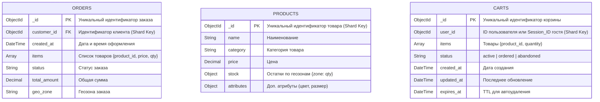

# Схема БД

### Обоснование выбора стратегии
#### Коллекция orders
- Почему customer_id (Range):
    - Локальность запросов: Основная операция - «Поиск истории заказов конкретного пользователя». При шардировании по customer_id все заказы одного клиента хранятся на одном шарде. Это позволяет выполнять запросы без рассеивания (scatter-gather) по всем шардам.
    - Сортировка: Диапазонное шардирование позволяет эффективно сортировать заказы по дате (created_at) в пределах одного клиента, так как данные физически расположены рядом.
    - Балансировка: Распределение клиентов обычно достаточно равномерное, что предотвращает появление «горячих» шардов, в отличие от шардирования по времени (created_at), где последний шард стал бы точкой записи для всех новых заказов.
#### Коллекция products
- Почему _id (Hashed):
    - Равномерная запись: Операция «Частые обновления остатков» происходит для конкретных товаров. Хеширование _id гарантирует равномерное распределение записей по кластеру.
    - Избежание горячих точек: Если использовать category, популярные категории (например, «Смартфоны») создадут дисбаланс нагрузки (hotspots), так как на один шард придется большинство операций чтения и записи.
    - Чтение: Поиск по категориям потребует рассеивания запроса, но это допустимо для каталога, так как чтение масштабируется репликацией, а запись (остатки) критична для производительности.
#### Коллекция carts
- Почему user_id (Range) с подменой для гостей:
    - Атомарность операций: Все операции с корзиной (добавление, удаление, слияние) должны выполняться атомарно в рамках одного документа. Шардирование по владельцу гарантирует, что корзина всегда находится на одном шарде.
    - Слияние корзин: При логине нужно объединить гостевую и пользовательскую корзины. Если обе корзины шардируются по одному логическому ключу (user_id, куда для гостя пишется session_id), приложение может гарантировать, что целевая корзина найдется предсказуемо.
    - TTL: Индекс по expires_at работает локально на каждом шарде, что эффективно для очистки старых гостевых корзин.
    - Производительность: Получение корзины происходит по точному совпадению ключа, что является самой быстрой операцией в шардированном кластере.
